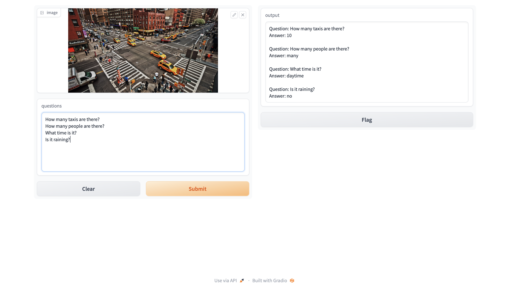

This is a simple Q&A explorer which uses [ViLT](https://huggingface.co/docs/transformers/model_doc/vilt) fine tuned for visual Q&A use.

## Setup and Usage

To start, just install the latest dependencies:

```sh
pip3 install -U -r requirements.txt
```

Then run:

```sh
gradio app
```

To use it, simply provide an image and a question per line.

## Screenshot


